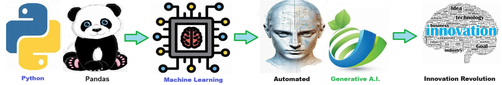

    
# A.I. Prompt Generator 

## Produce high quality prompts to get the most out of AI.

    
## AI prompt engineering

**AI prompt engineering** involves designing and refining inputs (prompts) given to an AI model to generate the most relevant and accurate responses. This practice is crucial because well-crafted prompts can significantly enhance the performance of AI systems, ensuring they understand the context and deliver precise, useful outputs. Effective prompt engineering is vital for leveraging AI capabilities in various applications, from customer support to content creation, thereby improving efficiency and user experience.

**AI prompt engineering** is utilized by a wide range of professionals, including writers, marketers, developers, and educators, to enhance creativity, productivity, and efficiency in their respective fields. It benefits almost everyone by automating repetitive tasks, providing instant insights, and generating high-quality content, which saves time and allows individuals to focus on more complex and value-added activities. This broad applicability helps improve workflows, support decision-making, and drive innovation across various industries.

 ## A.I Prompt Elements 
 1. **Clarity and Specificity** - Clearly define the task or question you want the AI to address. Avoid ambiguous language to ensure the AI understands your intent. 
  2. **Context** - Provide enough background information or context to help the AI generate relevant and accurate responses. 
  3. **Conciseness** - Keep the prompt as brief as possible while including all necessary details. Long, complex prompts can lead to confusion. 
  4. **Examples** - Include examples if applicable to illustrate the desired outcome or format. This helps guide the AI's response. 
  5. **Constraints and Guidelines** - Specify any constraints or guidelines the AI should follow, such as word limits, tone, or format. 
  6. **Open-Ended vs. Close-Ended** - Decide whether you need an open-ended response (e.g., creative writing) or a close-ended one (e.g., specific answer) and structure the prompt accordingly. 
  7. **Relevance** - Ensure the prompt is directly related to the task at hand and avoid irrelevant information that can distract the AI. 
  8. **Iteration and Testing** - Test and refine the prompt through iterations to achieve the best possible results. Modify based on the AI's responses to improve clarity and effectiveness. 
  

## Getting Started

The goal of this solution is to **Jump Start** your development and have you up and running in 30 minutes. 

To get started with the **A.I. Prompt Generator** solution repository, follow these steps:
1. Clone the repository to your local machine.
2. Install the required dependencies listed at the top of the notebook.
3. Explore the example code provided in the repository and experiment.
4. Run the notebook and make it your own - **EASY !**
    
## 🧠 Solution Features

- ✅ Easy to understand and use  
- ✅ Easily Configurable 
- ✅ Quickly start your project with pre-built templates
- ✅ Its Fast and Automated
- ✅ Saves You Time 

## ⚙️ Key Features

- ✅ **Self Documenting** Automatically identifies and annotates major steps in a notebook, making the codebase readable and well structured.
- ✅ **Self Testing** Includes built in **unit tests** for each function to validate logic and ensure code reliability.
- ✅ **Easily Configurable** Uses a simple **config.ini** file for centralized settings and easy customization through key value pairs.
- ✅ **Talking Code** explains itself through inline commentary, helping you understand both **what** it does and **why** it does it.
- ✅ **Self Logging** extends Python’s standard **logging** module for **step by step runtime insights**.
- ✅ **Self Debugging** Includes debugging hooks and detailed error tracing to simplify development and troubleshooting.
- ✅ **Low Code or  No Code** Designed to minimize complexity — most full solutions are under 50 lines of code.
- ✅ **Educational** Each template includes educational narrative and background context to support learning, teaching, and collaborative development.

    